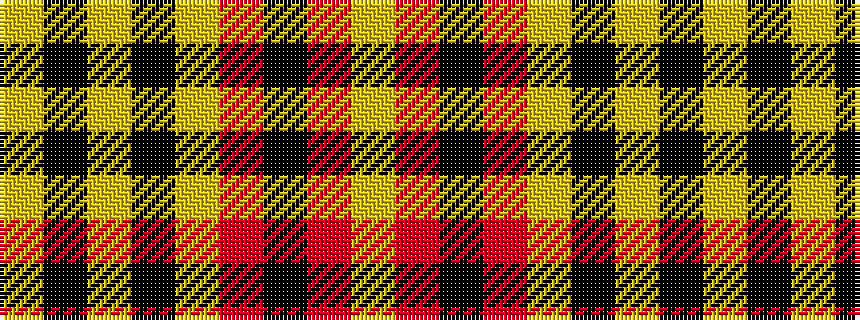

YKYKYRKRY

It is a 9 stripe tartan.

<figure class="pat-woven">

<figcaption>idealised sample</figcaption>
</figure>

## Colour Sequence



## Tartans with this colour sequence

| Tartans |
|---------------|
| [Anthony Plaid Ecru](/variants/s9/lr18k1ly3k1lr2r2k2r2lr2~x4/)|
||
