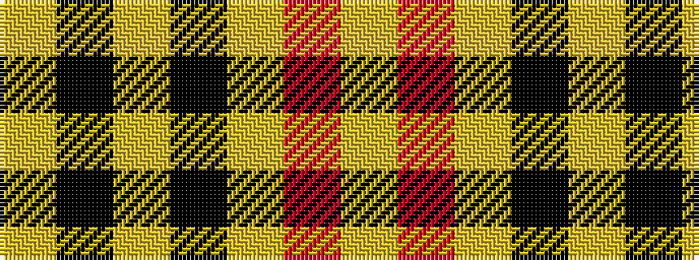

YKYKYRY

It is a 7 stripe tartan.

<figure class="pat-woven">

<figcaption>idealised sample</figcaption>
</figure>

## Colour Sequence



## Tartans with this colour sequence

| Tartans |
|---------------|
| [Baileville (Personal)](/variants/s7/ly1k4ly1k4ly11r1ly1~x4/)|
||
| [Baillieville](/variants/s7/ly1k4ly1k4ly11m1ly1~x4/)|
||
| [MacPherson Dress](/setts/lr3r1lr30k20lr3k9ly1/)|
||
