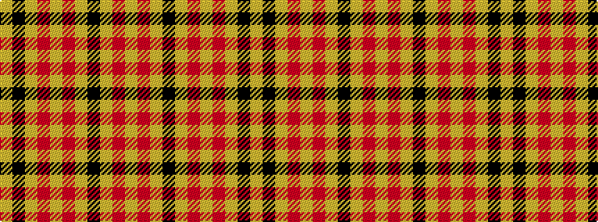

YKYRYRYKYRY

It is a 11 stripe tartan.

<figure class="pat-woven">

<figcaption>idealised sample</figcaption>
</figure>

## Colour Sequence



## Tartans with this colour sequence

| Tartans |
|---------------|
| [Dunbarton](/variants/s11/ly30r2ly2k5ly3o2ly3o22ly3k2ly3~x2/)|
||
| [Dunbarton Warp/Weft](/variants/s11/lo8r2lo2k5lo2o2lo3o7lo3k2lo3~x2/)|
||
