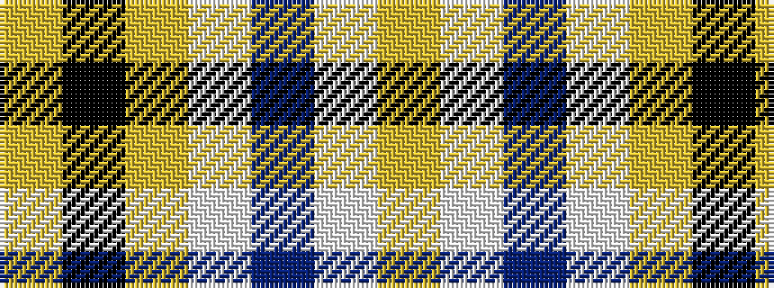

YKYWBWY

It is a 7 stripe tartan.

<figure class="pat-woven">

<figcaption>idealised sample</figcaption>
</figure>

## Colour Sequence



## Tartans with this colour sequence

| Tartans |
|---------------|
| [East Tennessee State University](/setts/s7/lo2w1db6w1ly2k17ly1~x2/)|
||
