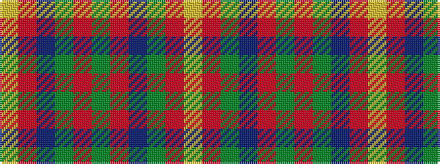

YRBGRGRBGRY

It is a 11 stripe tartan.

<figure class="pat-woven">

<figcaption>idealised sample</figcaption>
</figure>

## Colour Sequence



## Tartans with this colour sequence

| Tartans |
|---------------|
| [Callanish (District)](/variants/s11/ly2o2n2y2o6y3o3n3y2o2ly2~x2/)|
||
