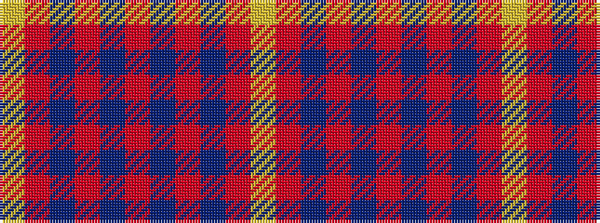

YRBRBRBRBRY

It is a 11 stripe tartan.

<figure class="pat-woven">

<figcaption>idealised sample</figcaption>
</figure>

## Colour Sequence



## Tartans with this colour sequence

| Tartans |
|---------------|
| [Griffiths (Welsh Name)](/variants/s11/lo4r37db17r4db8r6do2r5db2r3lo4/)|
||
