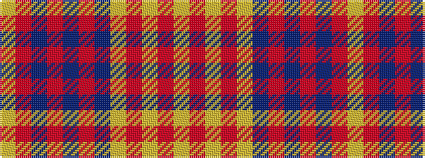

YRBRBRBYRYRY

It is a 12 stripe tartan.

<figure class="pat-woven">

<figcaption>idealised sample</figcaption>
</figure>

## Colour Sequence



## Tartans with this colour sequence

| Tartans |
|---------------|
| [Menzies VS](/tartans/lr4r1lr2r3lr24dr5r3dr1r1dr1r20lr2/)|
||
