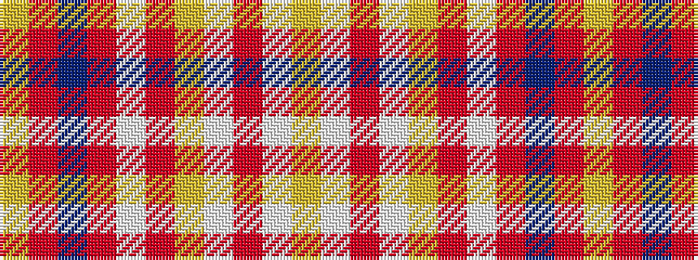

YRBRWRYWRWY

It is a 11 stripe tartan.

<figure class="pat-woven">

<figcaption>idealised sample</figcaption>
</figure>

## Colour Sequence



## Tartans with this colour sequence

| Tartans |
|---------------|
| [Nevis Dress](/variants/s11/lr42r10n2r2lb2r2lr10lb6r2lb3lr2~x2/)|
||
