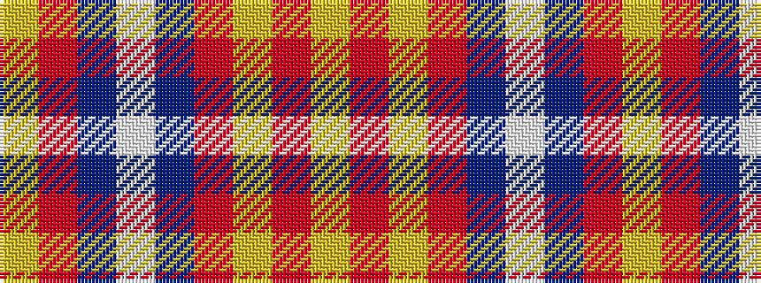

YRBWBRYRY

It is a 9 stripe tartan.

<figure class="pat-woven">

<figcaption>idealised sample</figcaption>
</figure>

## Colour Sequence



## Tartans with this colour sequence

| Tartans |
|---------------|
| [Arbroath Smokie](/variants/s9/lo1ri45dt23w1dt6r2lo1r2lo1~x2/)|
||
