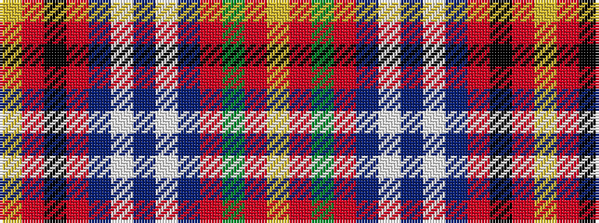

YRGRBWBWBRKRY

It is a 13 stripe tartan.

<figure class="pat-woven">

<figcaption>idealised sample</figcaption>
</figure>

## Colour Sequence



## Tartans with this colour sequence

| Tartans |
|---------------|
| [Maynard](/setts/s13/ly3r25k8r4db8w2db3w2db8r4g8r25ly3~x2/)|
||
