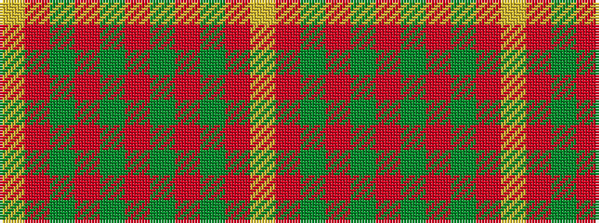

YRGRGRGRGRY

It is a 11 stripe tartan.

<figure class="pat-woven">

<figcaption>idealised sample</figcaption>
</figure>

## Colour Sequence



## Tartans with this colour sequence

| Tartans |
|---------------|
| [Bruce](/variants/s11/lr1r8dg2r2dg6r1dg6r2dg2r8ly1~x2/)|
||
| [Bruce](/variants/s11/lr1r4dg1r1dg3r1dg3r1dg1r4ly1~x2/)|
||
