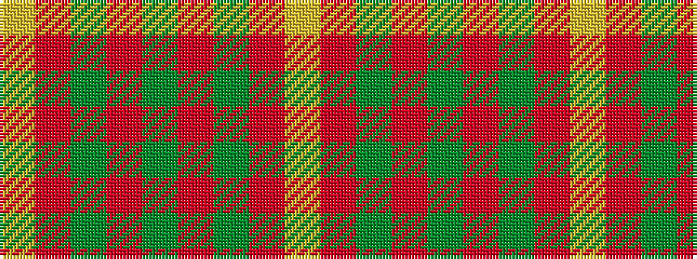

YRGRGRGRY

It is a 9 stripe tartan.

<figure class="pat-woven">

<figcaption>idealised sample</figcaption>
</figure>

## Colour Sequence



## Tartans with this colour sequence

| Tartans |
|---------------|
| [MacFie](/variants/s9/lr2r12dg2r1dg32r1dg2r12ly2/)|
||
| [MacPhie](/variants/s9/lr1r12dg2r1dg16r1dg2r12ly1~x2/)|
||
