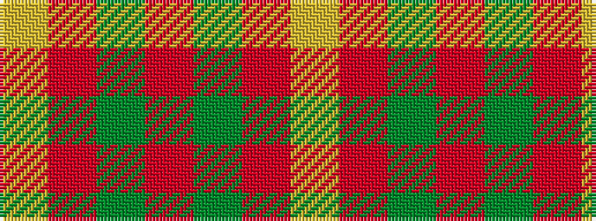

YRGRGRY

It is a 7 stripe tartan.

<figure class="pat-woven">

<figcaption>idealised sample</figcaption>
</figure>

## Colour Sequence



## Tartans with this colour sequence

| Tartans |
|---------------|
| [MacFie](/setts/s7/lr1r12dg2r1dg162r12ly1~x2/)|
||
| [Unidentified #42](/setts/s7/ly1r3dg7r3dg7r3ly1~x4/)|
||
| [Unidentified 24](/setts/s7/ly1r3g7r3g7r3ly1~x4/)|
||
