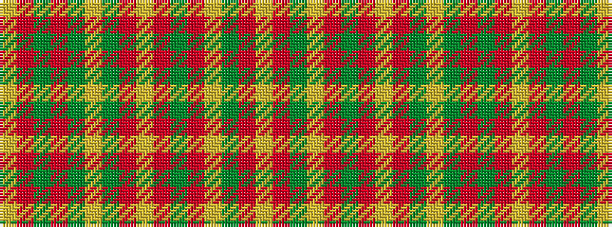

YRGRGYGRYRGRYGRY

It is a 16 stripe tartan.

<figure class="pat-woven">

<figcaption>idealised sample</figcaption>
</figure>

## Colour Sequence



## Tartans with this colour sequence

| Tartans |
|---------------|
| [Strathearn](/variants/s16/ly1r1g6ly8r1g1r1ly8r6g1ly1g1r6g6r1ly1~x2/)|
||
