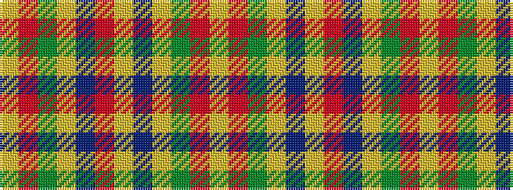

YRGYBRYBYGRY

It is a 12 stripe tartan.

<figure class="pat-woven">

<figcaption>idealised sample</figcaption>
</figure>

## Colour Sequence



## Tartans with this colour sequence

| Tartans |
|---------------|
| [Hallowfield Wood](/variants/s12/lo3r10dg4lo8do2lo8m11do16lo4dg4r10lo3~x2/)|
||
