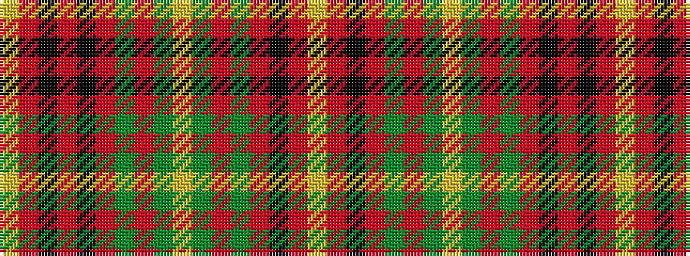

YRKRGRGYGRGRKRKRY

It is a 17 stripe tartan.

<figure class="pat-woven">

<figcaption>idealised sample</figcaption>
</figure>

## Colour Sequence



## Tartans with this colour sequence

| Tartans |
|---------------|
| [Gaffney (2016)](/variants/s17/ly1r2k4r14g8r2g3ly1g3r2g8r13k2r2k2r1ly1~x2/)|
||
