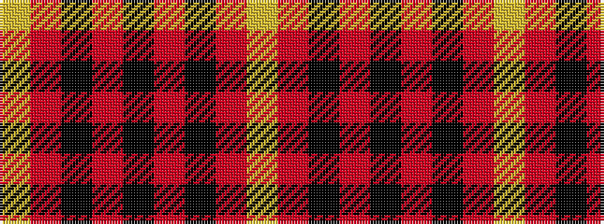

YRKRKRKRY

It is a 9 stripe tartan.

<figure class="pat-woven">

<figcaption>idealised sample</figcaption>
</figure>

## Colour Sequence



## Tartans with this colour sequence

| Tartans |
|---------------|
| [MacIver](/variants/s9/lr1r6k1r1k16r1k1r6ly1~x2/)|
||
| [MacIver](/variants/s9/lr1r12k2r2k16r2k2r12ly1~x2/)|
||
