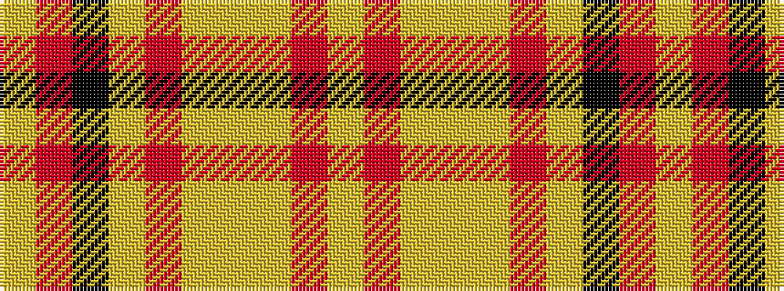

YRKYRYYYRY

It is a 10 stripe tartan.

<figure class="pat-woven">

<figcaption>idealised sample</figcaption>
</figure>

## Colour Sequence



## Tartans with this colour sequence

| Tartans |
|---------------|
| [Annan Trade Tartan](/variants/s10/loi15o1loi2lo2loi2o1loi3k8o10loi3~x4/)|
||
