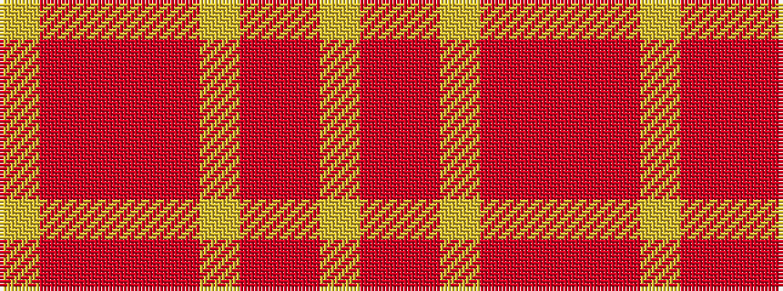

YRRRRYRRY

It is a 9 stripe tartan.

<figure class="pat-woven">

<figcaption>idealised sample</figcaption>
</figure>

## Colour Sequence



## Tartans with this colour sequence

| Tartans |
|---------------|
| [Unidentified, Sett](/setts/s9/lr2oi1r10o12oi10lr6r10oi1lr2~x2/)|
||
