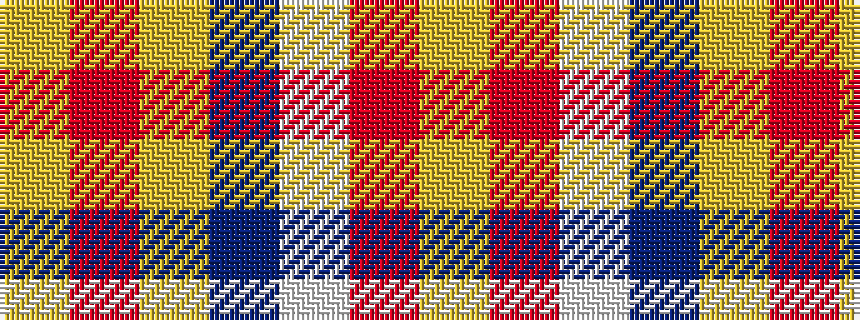

YRWBYRY

It is a 7 stripe tartan.

<figure class="pat-woven">

<figcaption>idealised sample</figcaption>
</figure>

## Colour Sequence



## Tartans with this colour sequence

| Tartans |
|---------------|
| [Barbour - Muted](/setts/s7/ly4r2ly21dt11w2o21lyi4~x2/)|
||
