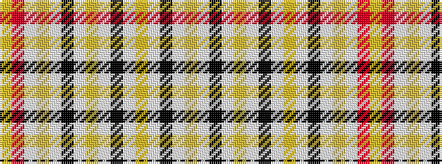

YRWYWKWYWKWYWKWY

It is a 16 stripe tartan.

<figure class="pat-woven">

<figcaption>idealised sample</figcaption>
</figure>

## Colour Sequence



## Tartans with this colour sequence

| Tartans |
|---------------|
| [City of Dorvil (District)](/setts/s16/lg4w1k3w1lo2w1k3w1lo2w1k3w1lg3lb14r1ly2~x2/)|
||
