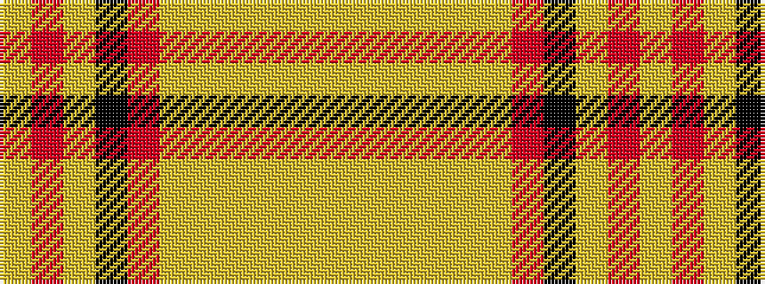

YRYKRYYYYYY

It is a 11 stripe tartan.

<figure class="pat-woven">

<figcaption>idealised sample</figcaption>
</figure>

## Colour Sequence



## Tartans with this colour sequence

| Tartans |
|---------------|
| [Glen Talloch](/setts/s11/lo32r2ly3k3r2lo3ly3lo3lyi3lo3lyi32~x2/)|
||
