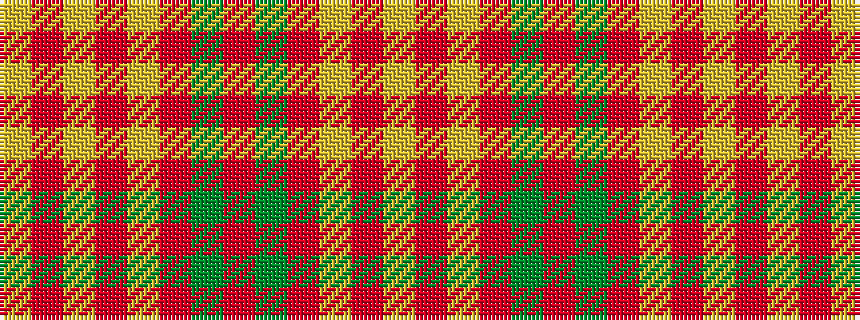

YRYRGRGRYRYRY

It is a 13 stripe tartan.

<figure class="pat-woven">

<figcaption>idealised sample</figcaption>
</figure>

## Colour Sequence



## Tartans with this colour sequence

| Tartans |
|---------------|
| [Poulter SG 101 (Fashion)](/setts/s13/lo25r8lo8r8lo8r46dy46r8dy46r46lo46r8lo8/)|
||
