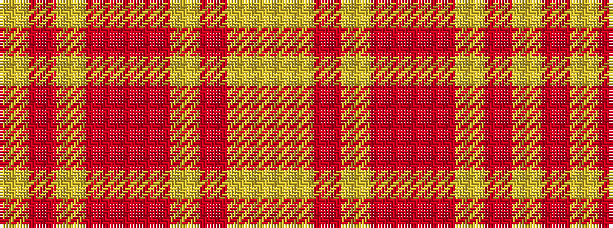

YRYRRRYRYY

It is a 10 stripe tartan.

<figure class="pat-woven">

<figcaption>idealised sample</figcaption>
</figure>

## Colour Sequence



## Tartans with this colour sequence

| Tartans |
|---------------|
| [Glasgow's Miles Better](/variants/s10/ly12lr4o4ly4o4r4o15lr15r15ly8~x2/)|
||
