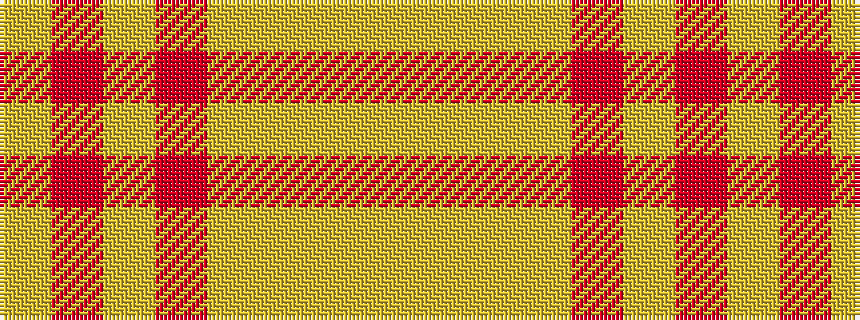

YRYRYYYY

It is a 8 stripe tartan.

<figure class="pat-woven">

<figcaption>idealised sample</figcaption>
</figure>

## Colour Sequence



## Tartans with this colour sequence

| Tartans |
|---------------|
| [PeachyKeen](/variants/s8/ly5lg2ly2lg35r20ly2r20ly2/)|
||
