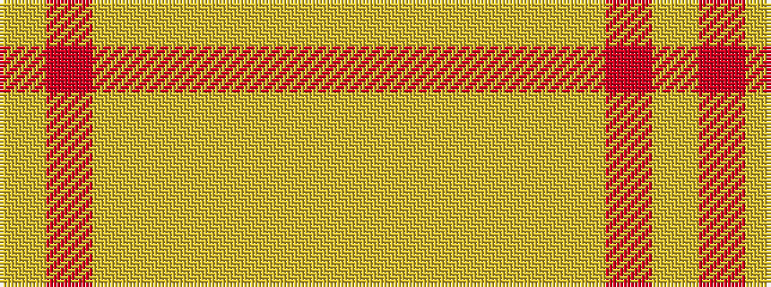

YRYYYYYY

It is a 8 stripe tartan.

<figure class="pat-woven">

<figcaption>idealised sample</figcaption>
</figure>

## Colour Sequence



## Tartans with this colour sequence

| Tartans |
|---------------|
| [Froach's Grian](/variants/s8/lr2m24lo14lr25lo14lr25ly20lr2~x2/)|
||
