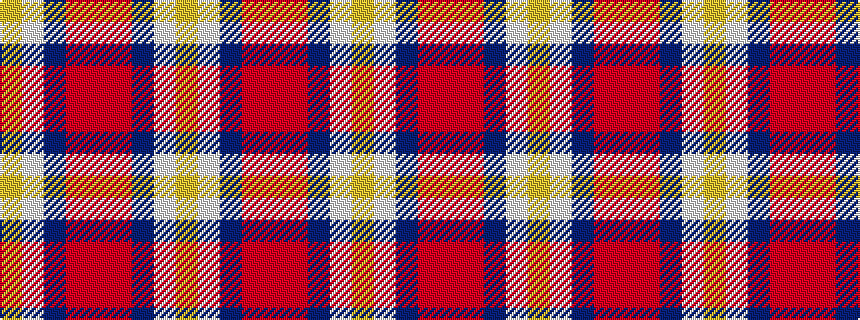

YWBRRRBWY

It is a 9 stripe tartan.

<figure class="pat-woven">

<figcaption>idealised sample</figcaption>
</figure>

## Colour Sequence



## Tartans with this colour sequence

| Tartans |
|---------------|
| [Wedding Day (Fashion)](/setts/s9/lo4w1dp48r2ri3r2dp3w1lo4~x2/)|
||
