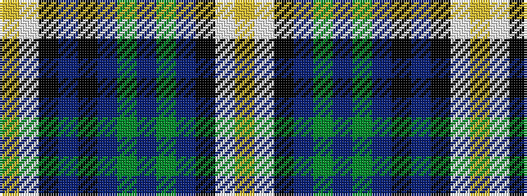

YWKBGBGBKBKWY

It is a 13 stripe tartan.

<figure class="pat-woven">

<figcaption>idealised sample</figcaption>
</figure>

## Colour Sequence



## Tartans with this colour sequence

| Tartans |
|---------------|
| [Cahaba Memorial](/setts/s13/lo2w3k1db9k1t6g1t3g1t19k2w7lo1~x2/)|
||
