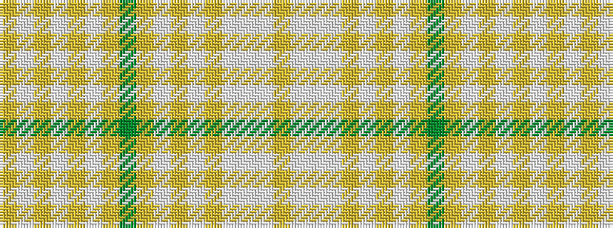

YWWWYWYWYGYWYWYWY

It is a 17 stripe tartan.

<figure class="pat-woven">

<figcaption>idealised sample</figcaption>
</figure>

## Colour Sequence



## Tartans with this colour sequence

| Tartans |
|---------------|
| [Clanedin (Commemorative)](/variants/s17/ly3lb10lb2lb4ly2lb3ly2lb2ly6dy3ly6lb2ly2lb3ly2lb8ly3~x2/)|
||
