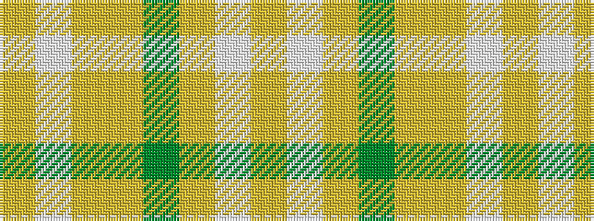

YWYGYYWY

It is a 8 stripe tartan.

<figure class="pat-woven">

<figcaption>idealised sample</figcaption>
</figure>

## Colour Sequence



## Tartans with this colour sequence

| Tartans |
|---------------|
| [Rikaco Morning Dew #2](/setts/s8/lr3lb3lr1y25lr15lr5lb4ly2~x2/)|
||
