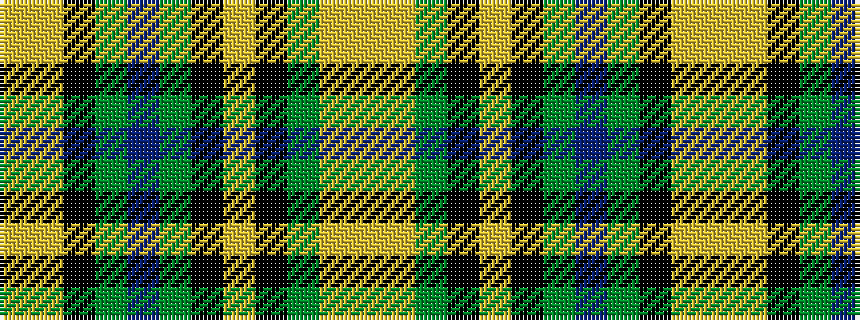

YYGKYKGBGKYY

It is a 12 stripe tartan.

<figure class="pat-woven">

<figcaption>idealised sample</figcaption>
</figure>

## Colour Sequence



## Tartans with this colour sequence

| Tartans |
|---------------|
| [Walker, Gauvin (Personal)](/setts/s12/lo1lg3k2g5dp4g1k14lg1k4g25lg2lo1~x2/)|
||
