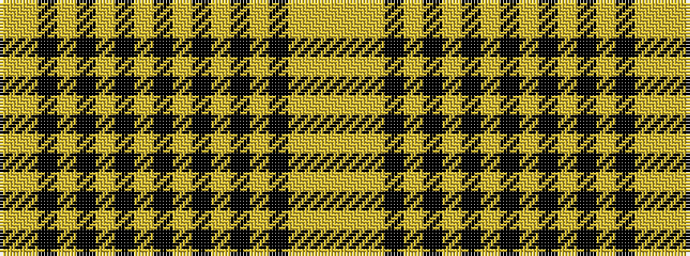

YYKYKYKYKYKYKYKYYY

It is a 18 stripe tartan.

<figure class="pat-woven">

<figcaption>idealised sample</figcaption>
</figure>

## Colour Sequence



## Tartans with this colour sequence

| Tartans |
|---------------|
| [Hannay Dress](/variants/s18/lg14lr4k9lr29k2lr4k2lr4k9lr4k2lr4k2lr29k9lr4lg14ly2~x2/)|
||
