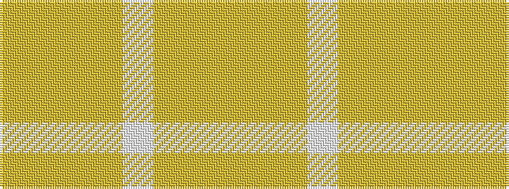

YYYWYYYY

It is a 8 stripe tartan.

<figure class="pat-woven">

<figcaption>idealised sample</figcaption>
</figure>

## Colour Sequence



## Tartans with this colour sequence

| Tartans |
|---------------|
| [Desert in Bloom](/setts/s8/lo3ly12lo12w3ly2ly26lo3ly1~x2/)|
||
