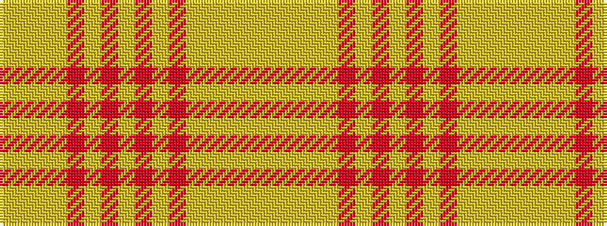

YYYYRYRYRYRYYYYY

It is a 16 stripe tartan.

<figure class="pat-woven">

<figcaption>idealised sample</figcaption>
</figure>

## Colour Sequence



## Tartans with this colour sequence

| Tartans |
|---------------|
| [Compaq](/setts/s16/lo1ly1lo1ly1r1ly1r1ly1r1ly1r1ly1lo1ly1lo1ly1~x6/)|
||
