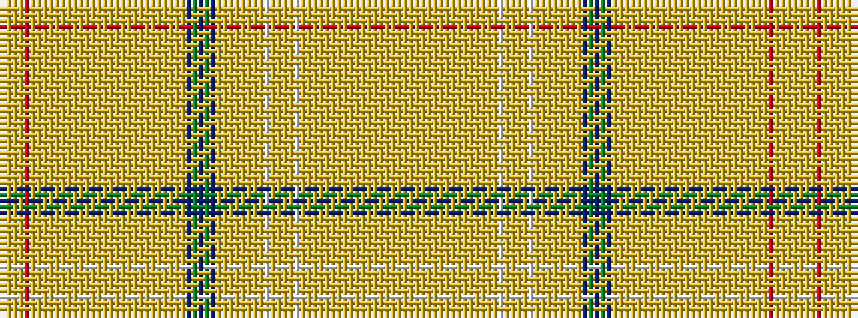

YYYYRYYYYYYYYYYYYYYYYYYYYYYYYYYBGBGBYYYYYYYYWYYYYWYYYYYYYYYYYYYYYYY

It is a 67 stripe tartan.

<figure class="pat-woven">

<figcaption>idealised sample</figcaption>
</figure>

## Colour Sequence



## Tartans with this colour sequence

| Tartans |
|---------------|
| [Hash House Harriers Trail (Corp)](/setts/s67/ly1lo1ly1lo1r4ly1lo1ly1lo1ly1lo1ly1lo1ly1lo1ly1lo1ly1lo1ly1lo1ly1lo1ly1lo1ly1lo1ly1lo1ly1lo1do28g28db4g28do28ly1lo1ly1lo1ly1lo1ly1lo1w4ly1lo1ly1lo1w4ly1lo1ly1lo1ly1lo1ly1lo1ly1lo1ly1lo1ly1lo1ly1lo1ly1-h14a4f2c28f558f15/)|
||
