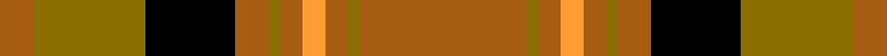

Sett from Paton's collection, housed at the Scottish Tartans Museum, Comrie; likely assembled around the 1830s.

The **Annan** tartan groups 3 setts — the same named design recorded as different cloths
(its kilt, Carpet, Child's…, or a transcription apart). The master sett (★) is the exemplar.

<table class="sett-table">
<thead><tr><th>Sett</th><th>Thread count</th><th>Variants</th></tr></thead>
<tbody>
<tr><td><a href="/setts/loi15o1loi2lo2loi2o1loi3k8o10loi3/">Annan</a> ★</td><td><code>LOi/60 O4 LOi8 LO8 LOi8 O4 LOi12 K32 O40 LOi/12</code></td><td>2</td></tr>
<tr><td colspan="3" class="sett-swatch"></td></tr>
<tr><td><a href="/setts/o15y1o2lo2o2y1o3k8y10o3/">Annan</a></td><td><code>O/60 Y4 O8 LO8 O8 Y4 O12 K32 Y40 O/12</code></td><td>1</td></tr>
<tr><td colspan="3" class="sett-swatch"></td></tr>
<tr><td><a href="/setts/y16oi2y2o2y2oi2y2do6n10y3/">(Fashion)</a></td><td><code>Y/32 Oi4 Y4 O4 Y4 Oi4 Y4 DO12 N20 Y/6</code></td><td>1</td></tr>
<tr><td colspan="3" class="sett-swatch"></td></tr>
</tbody>
</table>

