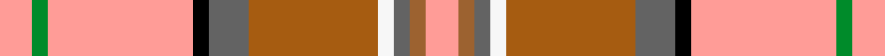

The **Australian Heavy Horse** tartan groups 2 setts — the same named design recorded as different cloths
(its kilt, Carpet, Child's…, or a transcription apart). The master sett (★) is the exemplar.

<table class="sett-table">
<thead><tr><th>Sett</th><th>Thread count</th><th>Variants</th></tr></thead>
<tbody>
<tr><td><a href="/setts/nii4ni2nii18k2n5do16w2n2lr2nii4/">Australian Heavy Horse</a> ★</td><td><code>Nii/8 Ni4 Nii36 K4 N10 DO32 W4 N4 LR4 Nii/8</code></td><td>1</td></tr>
<tr><td colspan="3" class="sett-swatch"></td></tr>
<tr><td><a href="/setts/lr4oi2n2w2o16n5k2lr18g2lr4/">(Corporate)</a></td><td><code>LR/8 G4 LR36 K4 N10 O32 W4 N4 Oi4 LR/8</code></td><td>1</td></tr>
<tr><td colspan="3" class="sett-swatch"></td></tr>
</tbody>
</table>

