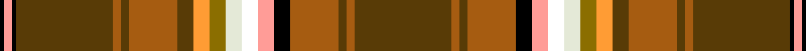

<nav class="crumbs crumbs-structural"><a href="/stripes/">Patterns</a> › <a href="/stripes/gkykgrgrkywwgygrgr/">GKYKGRGRKYWWGYGRGR</a></nav>
A tartan of the [Bear](/families/bear/) family.
Its design is pattern [GKYKGRGRKYWWGYGRGR](/stripes/gkykgrgrkywwgygrgr/) — the page of every tartan sharing this colour sequence.

Designed to promote identity within the International Bear Community, its colours derived from the Bear Brotherhood flag.

The **Bear** tartan groups 3 setts — the same named design recorded as different cloths
(its kilt, Carpet, Child's…, or a transcription apart). The master sett (★) is the exemplar.

<table class="sett-table">
<thead><tr><th>Sett</th><th>ΔTartan</th><th>Thread count</th><th>Threads</th><th>Date</th></tr></thead>
<tbody>
<tr><td><a href="/variants/s18/dy24k1lr2k1dy24o2dy2o12k4lr4w4wi4y4lo4dy4o12dy2o2~x2~dy1503076-lr3000000-wi3701120/">Bear</a> ★</td><td></td><td><code>DY/48 K2 LR4 K2 DY48 O4 DY4 O24 K8 LR8 W8 Wi8 Y8 LO8 DY8 O24 DY4 O/4</code></td><td>396</td><td>2005</td></tr>
<tr><td colspan="5" class="sett-swatch"></td></tr>
<tr><td><a href="/variants/s18/dy24o2dy2o12k4lr4w4wi4y4lo4dy4o12dy2o2dy24k1lr2k1~x2~lr3000000-wi3701120/">(Corporate)</a></td><td>1.42</td><td><code>K/2 LR4 K2 DY48 O4 DY4 O24 DY8 LO8 Y8 Wi8 W8 LR8 K8 O24 DY4 O4 DY/48</code></td><td>398</td><td>2005</td></tr>
<tr><td colspan="5" class="sett-swatch"></td></tr>
<tr><td><a href="/variants/s18/dy24o2dy2o12k4lr4wi4w4y4lo4dy4o12dy2o2dy24k1lr2k1~x2~dy1503076-wi4000000-w3701120/">Corporate Tartan</a></td><td>0.90</td><td><code>K/2 LR4 K2 DY48 O4 DY4 O24 DY8 LO8 Y8 W8 Wi8 LR8 K8 O24 DY4 O4 DY/48</code></td><td>398</td><td>2005</td></tr>
<tr><td colspan="5" class="sett-swatch"></td></tr>
</tbody>
</table>

## Nearest tartans

The nearest NAMED TARTANS — each represented by its master sett — by ΔTartan distance from this tartan's master, which leads the table so the swatches line up against it.

ΔTartan

Threads

Variant

Sett

—

396

<a href="/variants/s18/dy24k1lr2k1dy24o2dy2o12k4lr4w4wi4y4lo4dy4o12dy2o2~x2~dy1503076-lr3000000-wi3701120/">Bear</a>

<a href="/ttd/edit/#slug=y30k1r4k1b3g5dg4lb6r2w2~x2&amp;base=dy24k1lr2k1dy24o2dy2o12k4lr4w4wi4y4lo4dy4o12dy2o2~x2~dy1503076-lr3000000-wi3701120" title="compare in the TTD">3.50</a>

168

<a href="/variants/s10/y30k1r4k1b3g5dg4lb6r2w2~x2/">Essex, County Ontario</a>

<a href="/ttd/edit/#slug=ly4g4db8r8g8r27k3w1r27lb6g8db8g4ly4~x2&amp;base=dy24k1lr2k1dy24o2dy2o12k4lr4w4wi4y4lo4dy4o12dy2o2~x2~dy1503076-lr3000000-wi3701120" title="compare in the TTD">3.68</a>

464

<a href="/variants/s14/ly4g4db8r8g8r27k3w1r27lb6g8db8g4ly4~x2/">West Virginia</a>

<a href="/ttd/edit/#slug=r25w2o5dg2db2o5w2g12w2b2o2r5k2r5o2b2w2o9~x2&amp;base=dy24k1lr2k1dy24o2dy2o12k4lr4w4wi4y4lo4dy4o12dy2o2~x2~dy1503076-lr3000000-wi3701120" title="compare in the TTD">3.87</a>

284

<a href="/variants/s18/r25w2o5dg2db2o5w2g12w2b2o2r5k2r5o2b2w2o9~x2/">Campbell, New Louden</a>

<a href="/ttd/edit/#slug=db8lb1k6y1k2w2k2g12o28w1o4~x2&amp;base=dy24k1lr2k1dy24o2dy2o12k4lr4w4wi4y4lo4dy4o12dy2o2~x2~dy1503076-lr3000000-wi3701120" title="compare in the TTD">3.89</a>

244

<a href="/variants/s11/db8lb1k6y1k2w2k2g12o28w1o4~x2/">MacLean of Kingairloch</a>

<a href="/ttd/edit/#slug=w2k1ri3lb3ri3r3ri12r3ri3db3ri3db19y3g19ri3db3ri3r3ri12r3ri3lb3ri3k1w2~x2~ri2109032-r1807008&amp;base=dy24k1lr2k1dy24o2dy2o12k4lr4w4wi4y4lo4dy4o12dy2o2~x2~dy1503076-lr3000000-wi3701120" title="compare in the TTD">3.94</a>

468

<a href="/variants/s25/w2k1ri3lb3ri3r3ri12r3ri3db3ri3db19y3g19ri3db3ri3r3ri12r3ri3lb3ri3k1w2~x2~ri2109032-r1807008/">Fitzgerald dress</a>

<a href="/ttd/edit/#slug=db6w2k2r6dy2g12r6t3k3t3r28dy4~x2~r2109032-t2503227&amp;base=dy24k1lr2k1dy24o2dy2o12k4lr4w4wi4y4lo4dy4o12dy2o2~x2~dy1503076-lr3000000-wi3701120" title="compare in the TTD">3.95</a>

288

<a href="/variants/s12/db6w2k2r6dy2g12r6t3k3t3r28dy4~x2~r2109032-t2503227/">Wren</a>

<a href="/ttd/edit/#slug=lo18r3g30t4k2w2k2t4r37y1r3y1r3~x2&amp;base=dy24k1lr2k1dy24o2dy2o12k4lr4w4wi4y4lo4dy4o12dy2o2~x2~dy1503076-lr3000000-wi3701120" title="compare in the TTD">3.96</a>

398

<a href="/variants/s13/lo18r3g30t4k2w2k2t4r37y1r3y1r3~x2/">Sri Lanka</a>

## Neighbour map

Every grey dot is one of 10270 named tartans (their master setts) placed by the first two principal components of the ΔTartan feature space (42% of its variance). Red is this tartan; blue dots are its nearest — click one to open its master cloth. The map is a flat projection of a many-dimensional space — [how to read it](/posts/neighbourhood-maps/).

<svg viewBox="0 0 640 380" role="img" style="max-width:100%;height:auto;border:1px solid #e0e0e0;border-radius:4px;display:block" xmlns="http://www.w3.org/2000/svg"><image href="/nn/cloud-tartans.v1.png" width="640" height="380"/><a href="/variants/s10/y30k1r4k1b3g5dg4lb6r2w2~x2/"><circle cx="232.4" cy="61.9" r="4" fill="#3465a4"><title>Essex, County Ontario</title></circle></a><a href="/variants/s14/ly4g4db8r8g8r27k3w1r27lb6g8db8g4ly4~x2/"><circle cx="201.1" cy="75.1" r="4" fill="#3465a4"><title>West Virginia</title></circle></a><a href="/variants/s18/r25w2o5dg2db2o5w2g12w2b2o2r5k2r5o2b2w2o9~x2/"><circle cx="123.1" cy="81.1" r="4" fill="#3465a4"><title>Campbell, New Louden</title></circle></a><a href="/variants/s11/db8lb1k6y1k2w2k2g12o28w1o4~x2/"><circle cx="190.8" cy="64.4" r="4" fill="#3465a4"><title>MacLean of Kingairloch</title></circle></a><a href="/variants/s25/w2k1ri3lb3ri3r3ri12r3ri3db3ri3db19y3g19ri3db3ri3r3ri12r3ri3lb3ri3k1w2~x2~ri2109032-r1807008/"><circle cx="108.9" cy="54.2" r="4" fill="#3465a4"><title>Fitzgerald dress</title></circle></a><a href="/variants/s12/db6w2k2r6dy2g12r6t3k3t3r28dy4~x2~r2109032-t2503227/"><circle cx="191.9" cy="90.9" r="4" fill="#3465a4"><title>Wren</title></circle></a><a href="/variants/s13/lo18r3g30t4k2w2k2t4r37y1r3y1r3~x2/"><circle cx="205.6" cy="56.5" r="4" fill="#3465a4"><title>Sri Lanka</title></circle></a><circle cx="193.0" cy="57.7" r="5" fill="#c00000"/><text x="320" y="376" text-anchor="middle" font-size="11" fill="#999">ground</text><text x="11" y="190" text-anchor="middle" font-size="11" fill="#999" transform="rotate(-90 11 190)">complexity</text></svg>
