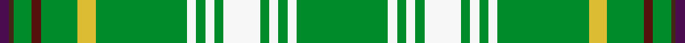

A tartan of the [Bryant](/families/bryant/) family.
Its design is pattern [BBGBGYGWGWGWGWGWG](/stripes/bbgbgygwgwgwgwgwg/) — the page of every tartan sharing this colour sequence.

The **Bryant** tartan groups 2 setts — the same named design recorded as different cloths
(its kilt, Carpet, Child's…, or a transcription apart). The master sett (★) is the exemplar.

<table class="sett-table">
<thead><tr><th>Sett</th><th>Thread count</th><th>Threads</th><th>Date</th></tr></thead>
<tbody>
<tr><td><a href="/setts/g20lb2g2lb2g2lb8g2lb2g2lb2g20ly4g8dr2g4do1dp2/">Bryant</a> ★</td><td><code>G/40 LB4 G4 LB4 G4 LB16 G4 LB4 G4 LB4 G40 LY8 G16 DR4 G8 DO2 DP/4</code></td><td>296</td><td>1993</td></tr>
<tr><td colspan="4" class="sett-swatch"></td></tr>
<tr><td><a href="/setts/g20w2g2w2g2w8g2w2g2w2g20ly4g8dr2g4do1dp2/">(Name)</a></td><td><code>G/40 W4 G4 W4 G4 W16 G4 W4 G4 W4 G40 LY8 G16 DR4 G8 DO2 DP/4</code></td><td>296</td><td>1993</td></tr>
<tr><td colspan="4" class="sett-swatch"></td></tr>
</tbody>
</table>

## Nearest tartans

The nearest NAMED TARTANS — each represented by its master sett — by ΔTartan distance from this tartan's master, which leads the table so the swatches line up against it.

ΔTartan

Threads

Variant

Sett

—

296

<a href="/variants/s17/g20lb2g2lb2g2lb8g2lb2g2lb2g20ly4g8dr2g4do1dp2~x2/">Bryant</a>

<a href="/ttd/edit/#slug=db6g3lb6g7y2g36y2g7lb6g3db6g3dy6g3r6g7y2g36y2g7r6g3dy6g3~x2&amp;base=g20lb2g2lb2g2lb8g2lb2g2lb2g20ly4g8dr2g4do1dp2~x2" title="compare in the TTD">3.70</a>

678

<a href="/variants/s24/db6g3lb6g7y2g36y2g7lb6g3db6g3dy6g3r6g7y2g36y2g7r6g3dy6g3~x2/">Sea Bees Regimental</a>

<a href="/ttd/edit/#slug=g30db6o1w2o6w2o1db6g30lb1dr3~x2&amp;base=g20lb2g2lb2g2lb8g2lb2g2lb2g20ly4g8dr2g4do1dp2~x2" title="compare in the TTD">3.94</a>

286

<a href="/variants/s11/g30db6o1w2o6w2o1db6g30lb1dr3~x2/">Kuehle Hunting</a>

<a href="/ttd/edit/#slug=g30db6o1w2o6w2o1db6g30lb1dp3~x2&amp;base=g20lb2g2lb2g2lb8g2lb2g2lb2g20ly4g8dr2g4do1dp2~x2" title="compare in the TTD">3.99</a>

286

<a href="/variants/s11/g30db6o1w2o6w2o1db6g30lb1dp3~x2/">Kuehle Family Hunting</a>

## Neighbour map

Every grey dot is one of 10225 named tartans (their master setts) placed by the first two principal components of the ΔTartan feature space (42% of its variance). Red is this tartan; blue dots are its nearest — click one to open its master cloth.

<svg viewBox="0 0 640 380" role="img" style="max-width:100%;height:auto;border:1px solid #e0e0e0;border-radius:4px;display:block" xmlns="http://www.w3.org/2000/svg"><image href="/nn/cloud-tartans.v1.png" width="640" height="380"/><a href="/variants/s24/db6g3lb6g7y2g36y2g7lb6g3db6g3dy6g3r6g7y2g36y2g7r6g3dy6g3~x2/"><circle cx="364.9" cy="107.5" r="4" fill="#3465a4"><title>Sea Bees Regimental</title></circle></a><a href="/variants/s11/g30db6o1w2o6w2o1db6g30lb1dr3~x2/"><circle cx="396.7" cy="108.1" r="4" fill="#3465a4"><title>Kuehle Hunting</title></circle></a><a href="/variants/s11/g30db6o1w2o6w2o1db6g30lb1dp3~x2/"><circle cx="395.1" cy="107.2" r="4" fill="#3465a4"><title>Kuehle Family Hunting</title></circle></a><circle cx="423.7" cy="139.0" r="5" fill="#c00000"/><text x="320" y="376" text-anchor="middle" font-size="11" fill="#999">ground</text><text x="11" y="190" text-anchor="middle" font-size="11" fill="#999" transform="rotate(-90 11 190)">complexity</text></svg>
