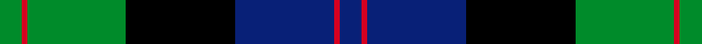

Its design is pattern [BRBKGRG](/stripes/brbkgrg/) — the page of every tartan sharing this colour sequence.

The **Blair** tartan groups 3 setts — the same named design recorded as different cloths
(its kilt, Carpet, Child's…, or a transcription apart). The master sett (★) is the exemplar.

<table class="sett-table">
<thead><tr><th>Sett</th><th>Thread count</th><th>Threads</th><th>Date</th></tr></thead>
<tbody>
<tr><td><a href="/setts/dg4r1dg18k20db18r1db4/">Blair</a> ★</td><td><code>DB/8 R2 DB36 K40 DG36 R2 DG/8</code></td><td>248</td><td>1999</td></tr>
<tr><td colspan="4" class="sett-swatch"></td></tr>
<tr><td><a href="/setts/db3r1db10k8g10r1g3/">Blair</a></td><td><code>G/12 R4 G40 K32 DB40 R4 DB/12</code></td><td>264</td><td>—</td></tr>
<tr><td colspan="4" class="sett-swatch"></td></tr>
<tr><td><a href="/setts/db4r1db18k20g18r1g4/">(Name)</a></td><td><code>DB/8 R2 DB36 K40 G36 R2 G/8</code></td><td>248</td><td>~1999</td></tr>
<tr><td colspan="4" class="sett-swatch"></td></tr>
</tbody>
</table>

