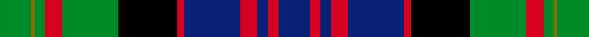

Its design is pattern [BRBRBRKGRGYG](/stripes/brbrbrkgrgyg/) — the page of every tartan sharing this colour sequence.

Bowie/Buie name linked to Argyllshire, Jura, Uist and Bute; designed by weaving manufacturer J. Dalgety.

The **Bowie** tartan groups 2 setts — the same named design recorded as different cloths
(its kilt, Carpet, Child's…, or a transcription apart). The master sett (★) is the exemplar.

<table class="sett-table">
<thead><tr><th>Sett</th><th>Thread count</th><th>Threads</th><th>Date</th></tr></thead>
<tbody>
<tr><td><a href="/setts/dg10lo2dg3r4dg13k13r2t13r4t3r2t10/">Bowie</a> ★</td><td><code>DG/20 LO4 DG6 R8 DG26 K26 R4 T26 R8 T6 R4 T/20</code></td><td>—</td><td>1978</td></tr>
<tr><td colspan="4" class="sett-swatch"></td></tr>
<tr><td colspan="4" class="sett-variants">2 Variants: <a href="/variants/s12/dg10lo2dg3r4dg13k13r2t13r4t3r2t10~x2/">(Name)</a> · <a href="/variants/s12/dg10lo2dg3r4dg13k13r2t13r4t3r2t10~x2~t2105244/">(Lochcarron)</a></td></tr>
<tr><td><a href="/setts/db9r3db3r5db16r2k17g16r5g3y1g9/">Bowie</a></td><td><code>G/18 Y2 G6 R10 G32 K34 R4 DB32 R10 DB6 R6 DB/18</code></td><td>320</td><td>—</td></tr>
<tr><td colspan="4" class="sett-swatch"></td></tr>
</tbody>
</table>

