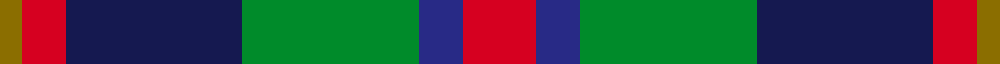

Its design is pattern [GRBGBR](/stripes/grbgbr/) — the page of every tartan sharing this colour sequence.

The **Canine All Dogs** tartan groups 2 setts — the same named design recorded as different cloths
(its kilt, Carpet, Child's…, or a transcription apart). The master sett (★) is the exemplar.

<table class="sett-table">
<thead><tr><th>Sett</th><th>Thread count</th><th>Threads</th><th>Date</th></tr></thead>
<tbody>
<tr><td><a href="/setts/r5t3g24db24r4y2/">Canine All Dogs</a> ★</td><td><code>R/10 T6 G48 DB48 R8 Y/4</code></td><td>234</td><td>2009</td></tr>
<tr><td colspan="4" class="sett-swatch"></td></tr>
<tr><td><a href="/setts/r10dbi6g24db24r6y3/">(Fashion)</a></td><td><code>R/10 DBi6 G24 DB24 R6 Y/3</code></td><td>133</td><td>2009</td></tr>
<tr><td colspan="4" class="sett-swatch"></td></tr>
</tbody>
</table>

