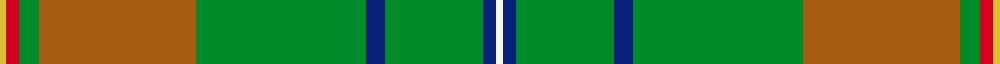

Its design is pattern [GRGRGBGBW](/stripes/grgrgbgbw/) — the page of every tartan sharing this colour sequence.

The **Canuck Place** tartan groups 2 setts — the same named design recorded as different cloths
(its kilt, Carpet, Child's…, or a transcription apart). The master sett (★) is the exemplar.

<table class="sett-table">
<thead><tr><th>Sett</th><th>Thread count</th><th>Threads</th><th>Date</th></tr></thead>
<tbody>
<tr><td><a href="/setts/y1r2g3o24g26db3g15db2w1/">Canuck Place</a> ★</td><td><code>Y/2 R4 G6 O48 G52 DB6 G30 DB4 W/2</code></td><td>304</td><td>2007</td></tr>
<tr><td colspan="4" class="sett-swatch"></td></tr>
<tr><td><a href="/setts/w1db2g15db3g26o24g3r2ly1/">(Corporate)</a></td><td><code>LY/2 R4 G6 O48 G52 DB6 G30 DB4 W/2</code></td><td>304</td><td>~2007</td></tr>
<tr><td colspan="4" class="sett-swatch"></td></tr>
</tbody>
</table>

