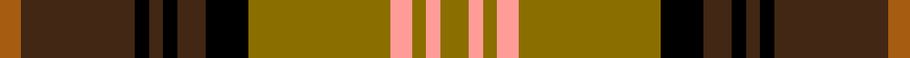

The **Dorcas** tartan groups 2 setts — the same named design recorded as different cloths
(its kilt, Carpet, Child's…, or a transcription apart). The master sett (★) is the exemplar.

<table class="sett-table">
<thead><tr><th>Sett</th><th>Thread count</th><th>Variants</th></tr></thead>
<tbody>
<tr><td><a href="/setts/r4g20dt2g2dt2g3dt6o26lb3o2lb2o4/">Dorcas</a> ★</td><td><code>R/8 G40 DT4 G4 DT4 G6 DT12 O52 LB6 O4 LB4 O/8</code></td><td>1</td></tr>
<tr><td colspan="3" class="sett-swatch"></td></tr>
<tr><td><a href="/setts/y4lr2y2lr3y20k6do4k2do2k2do16o3/">Dorcas</a></td><td><code>Y/8 LR4 Y4 LR6 Y40 K12 DO8 K4 DO4 K4 DO32 O/6</code></td><td>1</td></tr>
<tr><td colspan="3" class="sett-swatch"></td></tr>
</tbody>
</table>

## Also known as

This tartan is also recorded under:

- Scotch House 'Dorcas'
