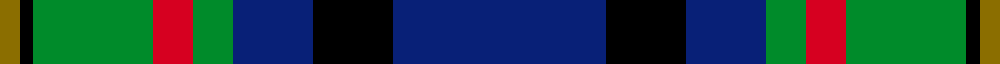

Its design is pattern [BKBGRGKG](/stripes/bkbgrgkg/) — the page of every tartan sharing this colour sequence.

The **Gillies** tartan groups 2 setts — the same named design recorded as different cloths
(its kilt, Carpet, Child's…, or a transcription apart). The master sett (★) is the exemplar.

<table class="sett-table">
<thead><tr><th>Sett</th><th>Thread count</th><th>Threads</th><th>Date</th></tr></thead>
<tbody>
<tr><td><a href="/setts/t32k12t12g6r6g18k2y3/">Gillies</a> ★</td><td><code>T/64 K24 T24 G12 R12 G36 K4 Y/6</code></td><td>294</td><td>2002</td></tr>
<tr><td colspan="4" class="sett-swatch"></td></tr>
<tr><td><a href="/setts/db32k12db12g6r6g18k2y3/">Gillies</a></td><td><code>DB/64 K24 DB24 G12 R12 G36 K4 Y/6</code></td><td>294</td><td>—</td></tr>
<tr><td colspan="4" class="sett-swatch"></td></tr>
</tbody>
</table>

