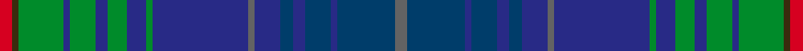

Its design is pattern [BBBBBBBBBGBGBGBGGR](/stripes/bbbbbbbbbgbgbgbggr/) — the page of every tartan sharing this colour sequence.

The **Glaz** tartan groups 2 setts — the same named design recorded as different cloths
(its kilt, Carpet, Child's…, or a transcription apart). The master sett (★) is the exemplar.

<table class="sett-table">
<thead><tr><th>Sett</th><th>Thread count</th><th>Threads</th><th>Date</th></tr></thead>
<tbody>
<tr><td><a href="/setts/n2dt9t1dt4t2dt2t4n1t15g1t3g3t2g4t1g7y1r2/">Glaz</a> ★</td><td><code>R/4 Y2 G14 T2 G8 T4 G6 T6 G2 T30 N2 T8 DT4 T4 DT8 T2 DT18 N/4</code></td><td>248</td><td>2013</td></tr>
<tr><td colspan="4" class="sett-swatch"></td></tr>
<tr><td><a href="/setts/n2db9dbi1db4dbi2db2dbi4n1dbi15g1dbi3g3dbi2g4dbi1g7dy1r2/">(Fashion)</a></td><td><code>N/4 DB18 DBi2 DB8 DBi4 DB4 DBi8 N2 DBi30 G2 DBi6 G6 DBi4 G8 DBi2 G14 DY2 R/4</code></td><td>248</td><td>2013</td></tr>
<tr><td colspan="4" class="sett-swatch"></td></tr>
</tbody>
</table>

