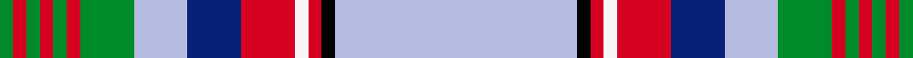

A tartan of [Clan Hill](/clan/hill/).
Its design is pattern [BKRWRBBGRGRGRG](/stripes/bkrwrbbgrgrgrg/) — the page of every tartan sharing this colour sequence.

The **Hill 70** tartan groups 2 setts — the same named design recorded as different cloths
(its kilt, Carpet, Child's…, or a transcription apart). The master sett (★) is the exemplar.

<table class="sett-table">
<thead><tr><th>Sett</th><th>Thread count</th><th>Threads</th><th>Date</th></tr></thead>
<tbody>
<tr><td><a href="/setts/t18k1r1w1r4db4t4g4r1g1r1g1r1g1/">Hill 70</a> ★</td><td><code>T/72 K4 R4 W4 R16 DB16 T16 G16 R4 G4 R4 G4 R4 G/4</code></td><td>—</td><td>2015</td></tr>
<tr><td colspan="4" class="sett-swatch"></td></tr>
<tr><td><a href="/setts/lb18k1r1w1r4db4lb4g4r1g1r1g1r1g1/">Hill 70</a></td><td><code>LB/72 K4 R4 W4 R16 DB16 LB16 G16 R4 G4 R4 G4 R4 G/4</code></td><td>268</td><td>2015</td></tr>
<tr><td colspan="4" class="sett-swatch"></td></tr>
</tbody>
</table>

