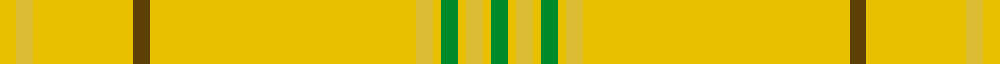

<nav class="crumbs crumbs-structural"><a href="/stripes/">Patterns</a> › <a href="/stripes/gygygygygyby/">GYGYGYGYGYBY</a></nav>

A tartan of the [Houston](/families/houston/) family.

Its design is pattern [GYGYGYGYGYBY](/stripes/gygygygygyby/) — the page of every tartan sharing this colour sequence.

The **Houston** tartan groups 3 setts — the same named design recorded as different cloths
(its kilt, Carpet, Child's…, or a transcription apart). The master sett (★) is the exemplar.

<table class="sett-table">
<thead><tr><th>Sett</th><th>ΔTartan</th><th>Thread count</th><th>Threads</th><th>Date</th></tr></thead>
<tbody>
<tr><td><a href="/variants/s12/ly32do2ly12dy2ly1g2ly1dy2ly1g2ly1dy2~x2/">Houston</a> ★</td><td></td><td><code>LY/64 DO4 LY24 DY4 LY2 G4 LY2 DY4 LY2 G4 LY2 DY/4</code></td><td>172</td><td>1994</td></tr>
<tr><td colspan="5" class="sett-swatch"></td></tr>
<tr><td colspan="5" class="sett-variants">2 Variants: <a href="/variants/s12/ly32do2ly12dy2ly1g2ly1dy2ly1g2ly1dy2~x2/">(Personal)</a> · <a href="/variants/s12/ly32do2ly12dy2ly1g2ly1dy2ly1g2ly1dy2~x2~ly6614084-dy3908078/">#2 (Personal)</a></td></tr>
<tr><td><a href="/variants/s12/g2lyi1ly2lyi1g2lyi1ly2lyi32dy2lyi12ly2lyi2~x2~lyi8117093-dy3908078/">Family Tartan</a></td><td>0.15</td><td><code>LYi/4 LY4 LYi24 DY4 LYi64 LY4 LYi2 G4 LYi2 LY4 LYi2 G/4</code></td><td>236</td><td>1994</td></tr>
<tr><td colspan="5" class="sett-swatch"></td></tr>
<tr><td><a href="/variants/s12/g2ly1dy2ly1g2ly1dy2ly32do2ly12dy2ly2~x2~ly6614084-dy3908078/">(Personal)</a></td><td>6.07</td><td><code>LY/4 DY4 LY24 DO4 LY64 DY4 LY2 G4 LY2 DY4 LY2 G/4</code></td><td>236</td><td>1994</td></tr>
<tr><td colspan="5" class="sett-swatch"></td></tr>
</tbody>
</table>

## Also known as

This tartan is also recorded under:

- Houston #2

## Nearest tartans

The nearest NAMED TARTANS — each represented by its master sett — by ΔTartan distance from this tartan's master, which leads the table so the swatches line up against it.

ΔTartan

Threads

Variant

Sett

—

172

<a href="/variants/s12/ly32do2ly12dy2ly1g2ly1dy2ly1g2ly1dy2~x2/">Houston</a>

<a href="/ttd/edit/#slug=dy4ly60dy2ly15dy2ly2lo2dy2ly8dy4y1dy2y2dy2y1~x2&amp;base=ly32do2ly12dy2ly1g2ly1dy2ly1g2ly1dy2~x2" title="compare in the TTD">2.25</a>

426

<a href="/variants/s15/dy4ly60dy2ly15dy2ly2lo2dy2ly8dy4y1dy2y2dy2y1~x2/">UPS No.1</a>

<a href="/ttd/edit/#slug=dy2ly8dy4y1dy2y2dy2y1dy4ly60dy2ly15dy2ly2lo2ly2~x2&amp;base=ly32do2ly12dy2ly1g2ly1dy2ly1g2ly1dy2~x2" title="compare in the TTD">2.39</a>

436

<a href="/variants/s16/dy2ly8dy4y1dy2y2dy2y1dy4ly60dy2ly15dy2ly2lo2ly2~x2/">UPS No.2</a>

<a href="/ttd/edit/#slug=lyi8dy2lyi2lo2lyi2dy2lyi15dy2lyi60dy4ly1dy2ly2dy2ly1dy4~x2~lyi8711084-lo7214075&amp;base=ly32do2ly12dy2ly1g2ly1dy2ly1g2ly1dy2~x2" title="compare in the TTD">3.25</a>

420

<a href="/variants/s16/lyi8dy2lyi2lo2lyi2dy2lyi15dy2lyi60dy4ly1dy2ly2dy2ly1dy4~x2~lyi8711084-lo7214075/">UPS No. 1</a>

<a href="/ttd/edit/#slug=ly44dr6ly6dr6ly6dr6ly6dr6ly44t3ly3g3ly3lb3&amp;base=ly32do2ly12dy2ly1g2ly1dy2ly1g2ly1dy2~x2" title="compare in the TTD">3.77</a>

243

<a href="/variants/s14/ly44dr6ly6dr6ly6dr6ly6dr6ly44t3ly3g3ly3lb3/">Catalan</a>

## Neighbour map

Every grey dot is one of 10814 named tartans (their master setts) placed by the first two principal components of the ΔTartan feature space (42% of its variance). Red is this tartan; blue dots are its nearest — click one to open its master cloth. The map is a flat projection of a many-dimensional space — [how to read it](/posts/neighbourhood-maps/).

<svg viewBox="0 0 640 380" role="img" style="max-width:100%;height:auto;border:1px solid #e0e0e0;border-radius:4px;display:block" xmlns="http://www.w3.org/2000/svg"><image href="/nn/cloud-tartans.v1.png" width="640" height="380"/><a href="/variants/s15/dy4ly60dy2ly15dy2ly2lo2dy2ly8dy4y1dy2y2dy2y1~x2/"><circle cx="547.7" cy="70.2" r="4" fill="#3465a4"><title>UPS No.1</title></circle></a><a href="/variants/s16/dy2ly8dy4y1dy2y2dy2y1dy4ly60dy2ly15dy2ly2lo2ly2~x2/"><circle cx="550.8" cy="66.7" r="4" fill="#3465a4"><title>UPS No.2</title></circle></a><a href="/variants/s16/lyi8dy2lyi2lo2lyi2dy2lyi15dy2lyi60dy4ly1dy2ly2dy2ly1dy4~x2~lyi8711084-lo7214075/"><circle cx="544.2" cy="65.7" r="4" fill="#3465a4"><title>UPS No. 1</title></circle></a><a href="/variants/s14/ly44dr6ly6dr6ly6dr6ly6dr6ly44t3ly3g3ly3lb3/"><circle cx="467.0" cy="135.2" r="4" fill="#3465a4"><title>Catalan</title></circle></a><circle cx="556.3" cy="112.5" r="5" fill="#c00000"/><text x="320" y="376" text-anchor="middle" font-size="11" fill="#999">ground</text><text x="11" y="190" text-anchor="middle" font-size="11" fill="#999" transform="rotate(-90 11 190)">complexity</text></svg>
