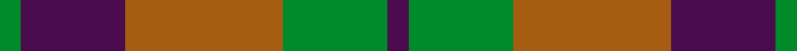

The **Harmony 6** tartan groups 2 setts — the same named design recorded as different cloths
(its kilt, Carpet, Child's…, or a transcription apart). The master sett (★) is the exemplar.

<table class="sett-table">
<thead><tr><th>Sett</th><th>Thread count</th><th>Variants</th></tr></thead>
<tbody>
<tr><td><a href="/setts/dg2dp10dy15dg10dp2/">Harmony 6</a> ★</td><td><code>DG/8 DP40 DY60 DG40 DP/8</code></td><td>1</td></tr>
<tr><td colspan="3" class="sett-swatch"></td></tr>
<tr><td><a href="/setts/dp2g10o15dp10g2/">Harmony, 6</a></td><td><code>G/8 DP40 O60 G40 DP/8</code></td><td>1</td></tr>
<tr><td colspan="3" class="sett-swatch"></td></tr>
</tbody>
</table>

## Also known as

This tartan is also recorded under:

- Harmony, 6
