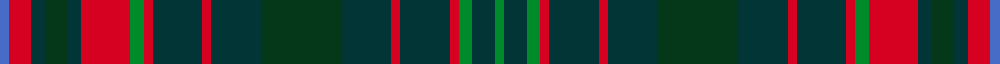

A tartan of the [Jorgensen of Taasinge](/families/jorgensen-of-taasinge/) family.

Danish family tartan with central green framed by autumn forest, sea, and violet sunset of Taasinge.

The **Jorgensen of Taasinge** tartan groups 2 setts — the same named design recorded as different cloths
(its kilt, Carpet, Child's…, or a transcription apart). The master sett (★) is the exemplar.

<table class="sett-table">
<thead><tr><th>Sett</th><th>Thread count</th><th>Variants</th></tr></thead>
<tbody>
<tr><td><a href="/setts/lr4r10dt6dg10dt6r22g6r4dt22r4dt22dg36dt22r4dt22r4g6dt10g3/">Jorgensen of Taasinge</a> ★</td><td><code>LR/4 R10 DT6 DG10 DT6 R22 G6 R4 DT22 R4 DT22 DG36 DT22 R4 DT22 R4 G6 DT10 G/3</code></td><td>1</td></tr>
<tr><td colspan="3" class="sett-swatch"></td></tr>
<tr><td><a href="/setts/g2dt5g3r2dt11r2dt11dg18dt11r2dt11r2g3r11dt3dg5dt3r5b2/">Family Tartan</a></td><td><code>G/4 DT10 G6 R4 DT22 R4 DT22 DG36 DT22 R4 DT22 R4 G6 R22 DT6 DG10 DT6 R10 B/4</code></td><td>1</td></tr>
<tr><td colspan="3" class="sett-swatch"></td></tr>
</tbody>
</table>

## Also known as

This tartan is also recorded under:

- Jrgensen of Taasingee
